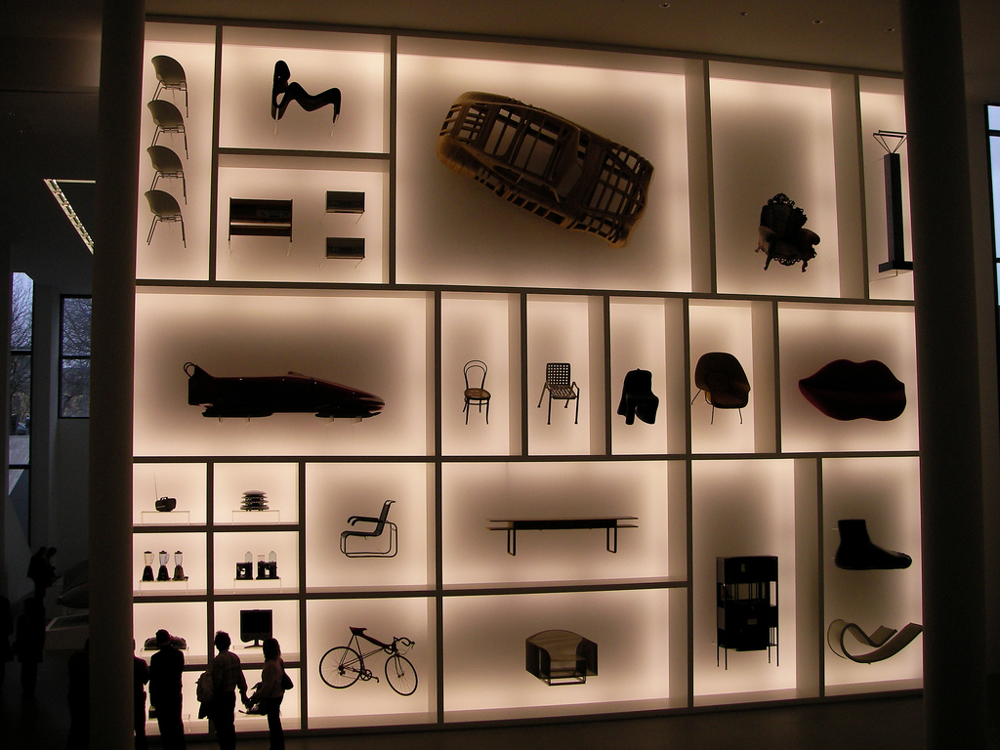
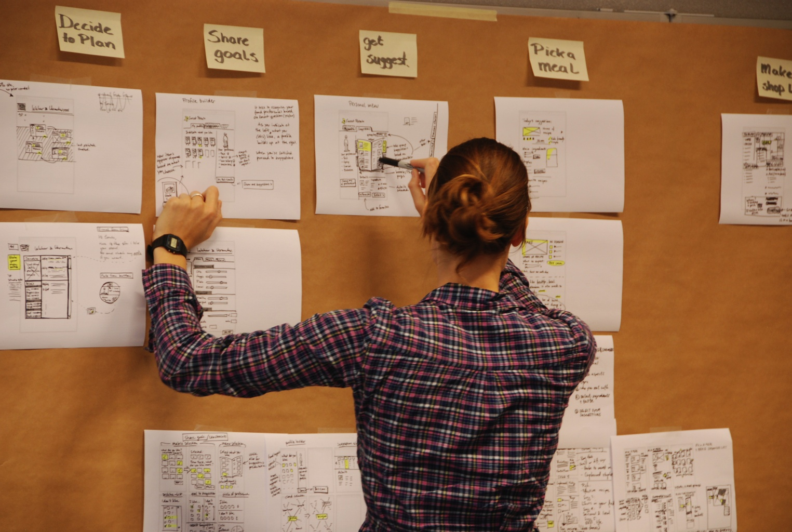
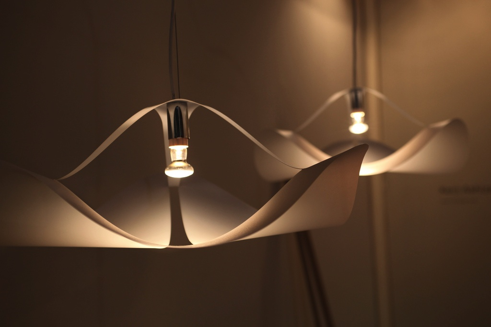

# 『HELLO WORLD ― 「デザイン」が私たちに必要な理由』

アリス・ローソーン著
『HELLO WORLD 「デザインが私たちに必要な理由」』フィルムアート社

　スティーブ・ジョブズが言ったといわれるデザインの定義がある。なんでもドイツ製の家庭用洗濯機が非常に気に入っていて、
その動きを飽かずに見ていたという彼の、デザインについての考えは次のようなものだそうだ：

>「デザインとは what it looks like ではなくて how it works だ」

見栄えではなくて、機能性、とでも言えばいいのだろうか。

　『HELLO WORLD ― 「デザイン」が私たちに必要な理由』では、様々な見地から「デザイン」が語られる。
デザインとは何か。上のジョブズのコメントに合致するクリアカットな例も挙げられている。

　強大な軍事力を誇った古代中国の始皇帝。
彼の軍事力の秘密の一端はデザインに対する理解にあったという。始皇帝の時代には、戦力は農民兵であり、彼らは手作りの弓矢で戦っていた。
しかし手作りであるが故に、一人の農民兵の矢は他の農民兵の弓では使えなかった。これでは兵が一人討たれると、その矢は全て無駄になってしまう。
始皇帝は、これを改め、矢の柄を正確に同じ長さにし、先端部は常に同じサイズと形状の三角柱につくらせた。
こうすることにより、矢を打ち尽くしても他の兵の矢が補充できるようになったという。ポイントは形ではない。状況全体に対する理解と解決である。

　本書で扱われるデザインも、形というよりは解決であるように思われる。個人的に言えば、ここ数年追いかけているデザイン思考についてのヒントもあった。  
デザイン思考とは、デザインファームIDEOの発想法として有名になったものだが、実はあまり明確な定義がないように思われる。
最近では、「デザイナーのスキルを用いて、諸問題を解決しようとすること」のような定義が使われる事が多い。
ではデザイナーのスキルとはなにか。本書のとある章にはこんなふうに読み取れる記述がある：基本的にデザイナーは単独では活動しない。
ビジネス、社会科学、心理学の専門家や、エスノグラファーなどと仕事をする。
デザイナーは、そのコミュニケーション能力を活かして人々の動機や願望、ニーズを理解し、ステイクホールダー間の調整を行う。
この個所でもまた、ポイントは形（だけ）ではない。

　本書の最終章のエピグラムは、人道的デザイン？のプロジェクトHを主催するエミリー・ピロトンの言葉である：
>「私は、デザインとは品性と先見性のある問題解決であると考えています。」

　　
　　　　
　　　　　　
　　　　　　

text: 0sh1ma  
Photo:  
http://www.flickr.com/photos/kurmis/405042590/
https://www.flickr.com/photos/designbyfire/5086905936/
http://www.flickr.com/photos/br1dotcom/4531335052/