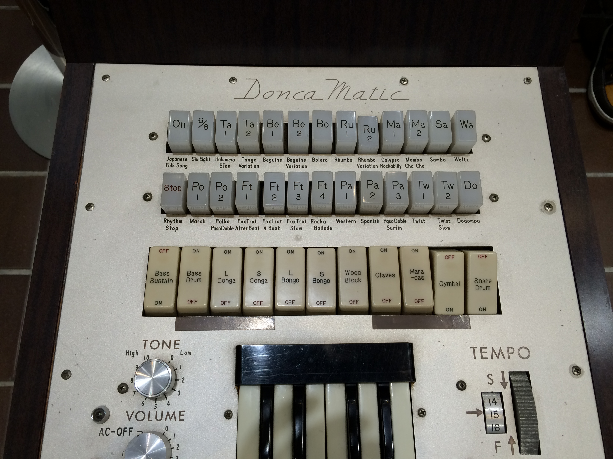
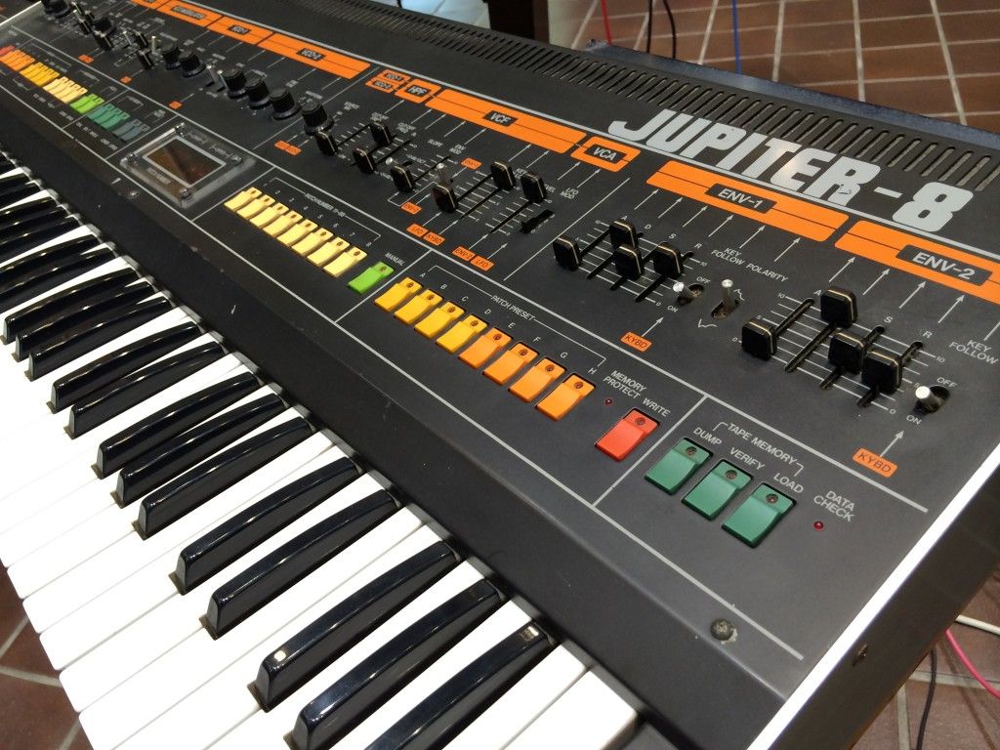
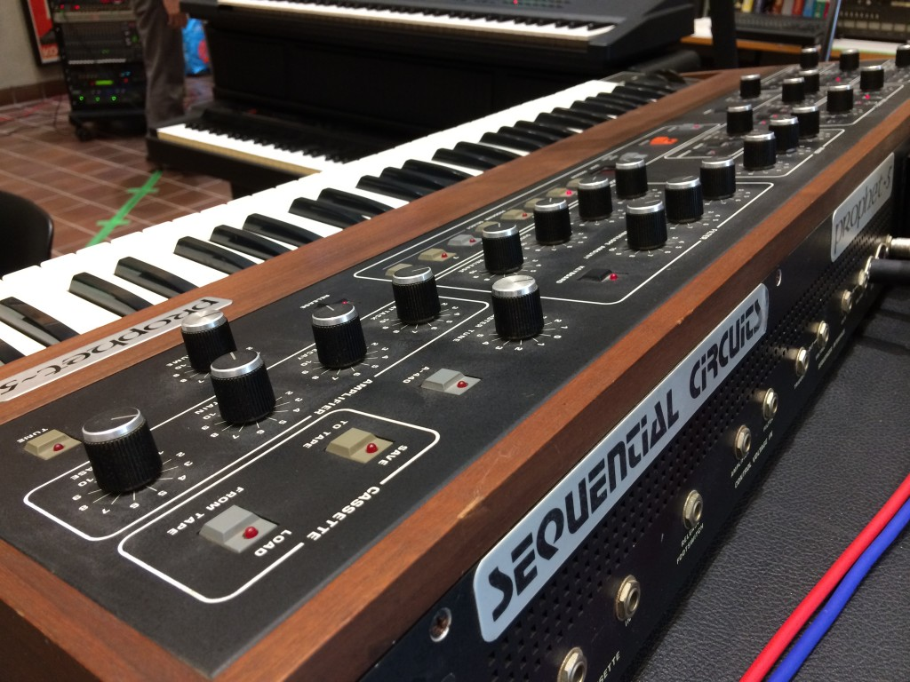

# HUMAN INTERFACE学会できいたこと

ヒューマンインタフェース学会というところに参加してきました。そこでちょっと面白い講演を聞いたので書いてみます。
HI（ヒューマンインタフェース）学会というのは、コンピュータと人間の接点についての研究発表がなされる学会です。今年は京都工芸繊維大学で開催されました。企画展示に往年のシンセサイザーの展示があったりして、個人的にはそちらも興味津々でした。

面白い講演というのは、特別講演としてなされた韓国KAISTのKun-Pyo Lee教授による”Changing User-Centered Design Methods for HCI”です。わたしのつたない英語力で理解できた範囲を書こうと思います。誤解している部分がある可能性もありますので鵜呑みにしないでください。

Lee教授はデザインに関する見識を買われてLGの副社長も務めた経歴があるという方です（HI学会ではデザインの研究発表も多く、特に「人間中心設計」というのが研究対象の一つであったりします。人間中心設計とは、技術的なことばかり優先されたデザインより、人間を中心に据えた使いやすいデザインを考えよう、という方法です）。
デザインの流れが変わってきている、ひょっとしたら従来の意味でのデザイナーは必要とされなくなるかもしれない、という前置きから始まった講演では、LGでの経験を踏まえてか、こんなエピソードがありました。

「１０年前の携帯は各社デザインが異なってカラフルだったのに、いまのスマートフォンはどれも同じ。デザインする部分が無くなってきています。かろうじてスマートフォンの背面にデザイナーの出番がありますが、ユーザはすぐにケースにいれてしまうから人目につくこともありません」
「テレビも同じです。ベゼルがどんどん薄くなってきて、画面しか残らない。デザインする部分が無くなりました。デザイナーはテレビスタンドに腕を振るうしかありませんが、アメリカ人は壁掛けテレビにしていまうので、これまた人目にふれることがありません」

また所謂プロダクトデザインについても、ネットの発達した今日、ユーザが現場でどのような製品の使い方をしているかを吸い上げて分析した方が、デザイナーがデザインするより良い製品がつくれる可能性があるのではないか。企業は完成したプロダクトを作るより、未完成の、しかしユーザがいじれる可能性を残した、non-Finito-product を作るべきなのではないか、とのことでした（参考文献として “Design by use” と “non intentional design” が挙げられました）。

確かに、製品が作り手の想定を越えた使い方をされることはあります。古い例では、鏡にルージュでメッセージを残してホワイトボード代わりにするとか、鉛筆をぐるぐる回してヘアピンにするとか、ピザの紙皿が二つ折りにされて手を汚さずにピザを食べる道具になったり、など。そういった、現場のユーザの知見を活かそう、ということでしょう。ユーザに可能性を残す意味では Google のモジュール携帯プロジェクト Ara が典型的な例かと思われます。

また、まだ私は未読なのですが、神戸大の小川進教授による「ユーザーイノベーション」も、これまでイノベーションは企業が行うものであったが、これからは個々のユーザのイノベーションを取り込むべきでないか、という内容のようです。
正直どうなるかは分かりませんが、ネットの力を使えば、この究極の（？）参加型デザイン（ユーザがデザインの過程に参加するデザイン手法）、成立しそうな気もします。